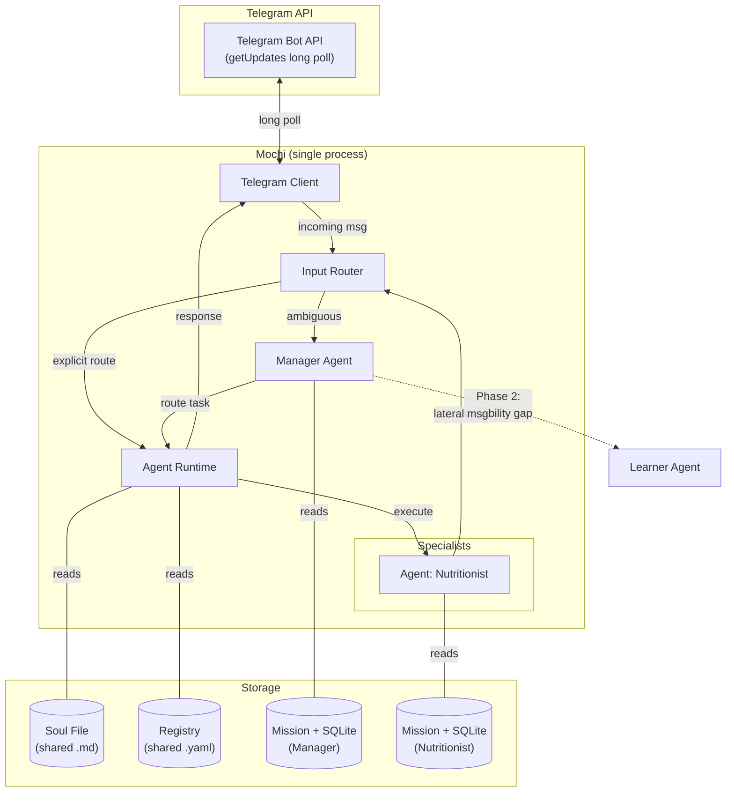

# Mochi — User Story & Requirements (v2)

## 1. Vision Statement

**Mochi** is a multi-agent service bot where *every job is owned by exactly one specialist agent*. Rather than a monolithic assistant that accumulates unbounded context, Mochi decomposes work across a network of focused agents — each with its own memory, skill set, and model configuration. When a new capability is needed, a dedicated Learner Agent discovers and packages the skill autonomously, with human approval before deployment.

### 1.1. Why Not Openclaw?

| Pain Point | Openclaw Behavior | Mochi Solution |
|---|---|---|
| **Bloated Memory** | One conversation history holds nutrition notes, travel plans, inventory — everything | Each agent owns only its domain's memory |
| **Skill Pollution** | Every tool/prompt is loaded regardless of the task | Agents carry only the skills their job requires |
| **Incompressible Context** | Summarizing a multi-domain history loses cross-domain nuance | Single-domain memory is trivially compressible |
| **Token Waste** | Full skill list + full history = expensive prompts | Minimal context → smaller prompts → lower cost |
| **One-Model-Fits-All** | The same heavy model handles trivial and complex tasks | Model is configured per-agent; lightweight models for simple jobs |
| **Manual Skill Addition** | New capabilities require developer effort | Learner Agent discovers and packages skills (with human approval) |

---

## 2. Technology Decisions

| Decision | Choice | Rationale |
|---|---|---|
| **Language** | Python | De facto standard for AI/LLM applications |
| **Architecture** | Single-process bot | Telegram client + agent runtime run in one process; no HTTP server needed |
| **Telegram Mode** | Long polling | Simpler to develop/deploy; no webhook, no ngrok, no public URL required |
| **Workflow Format** | YAML | Declarative, human-readable, constrainable for auto-generated skills |
| **Memory Persistence** | SQLite per-agent | Queryable, handles larger histories, isolated per-agent |
| **Learner Autonomy** | Semi-autonomous | Discovers and packages skills, but requires human approval before deployment |
| **MVP Frontend** | Telegram | Existing experience; rich bot API with buttons, commands, media |
| **Project Name** | Mochi | Confirmed |

---

## 3. MVP Scope

The MVP ships with **two agents** and the core infrastructure:

| Component | Role | In MVP? |
|---|---|---|
| Input Router | Route messages to the correct agent | ✅ |
| Manager Agent | Resolve ambiguous routing; orchestrate when no direct path exists | ✅ |
| Nutritionist Agent | Manage the user's daily diet (meal logging, macros, suggestions) | ✅ |
| Scheduler | Run recurring cron jobs and one-off scheduled tasks | ✅ |
| ToolRunner | Dynamic tool discovery and execution interface | ✅ |
| Learner Agent | Discover and package new skills | ❌ Phase 2 |
| Admin Agent | Self-deploy: create/edit agents, tools, and config via Telegram chat | ❌ Phase 2 |
| `/restart` command | Self-restart after code changes (via `os.execv`) | ❌ Phase 2 |
| SubprocessToolRunner | Sandboxed tool execution for generated code | ❌ Phase 2 |
| Workflow Engine | Execute learned skill workflows | ❌ Phase 2 |
| Additional Specialists | Travel, Inventory, etc. | ❌ Future |

---

## 4. User Stories

### 4.1. Specialization *(Kingpin Feature)*

> *As a user, I want every distinct type of task to be handled by a dedicated specialist agent, so that each agent operates with clean, minimal context and the system is cost-efficient.*

#### Acceptance Criteria

| # | Criterion | Rationale |
|---|---|---|
| S-1 | A user message is routed to the correct specialist agent without the user needing to know agent names. | The Router + Manager handle intent resolution transparently. |
| S-2 | Each agent's prompt contains **only** the Soul File + its own Mission File + its own Memory. No cross-agent context leaks. | Clean Memory — agents don't see each other's history. |
| S-3 | Each agent is configured with its own model (provider, model name, temperature, max tokens). | Model Efficiency — simple tasks use cheap models. |
| S-4 | An agent's memory can be independently compressed (summarized/truncated) without affecting other agents. | Compressible Memory — single-domain summaries are lossless. |
| S-5 | When Agent A needs work from Agent B, it issues a message through the Router (lateral communication), not by absorbing B's skills. | Professional Skillset — agents stay in their lane. |
| S-6 | Adding a new specialist requires only creating a Mission File + registering in the Registry; no code changes to the router or core. | Extensibility via configuration, not code. |

---

### 4.2. Self-Expandable *(Secondary Feature — Phase 2)*

> *As a user, I want the bot to autonomously learn new skills when it encounters a task no existing agent can handle, and present them for my approval before deployment.*

#### Acceptance Criteria

| # | Criterion | Rationale |
|---|---|---|
| E-1 | When the Manager cannot find a suitable agent for a task, it triggers a **Learner Agent** (not the end user). | Hands Free — no human in the loop for skill *discovery*. |
| E-2 | The Learner Agent operates in a sandboxed workspace, separate from the live runtime. | Learning and executing are different concerns. |
| E-3 | A learned skill is exported as a **YAML Workflow** — a reproducible sequence of steps, not free-form reasoning. | Agentic Automation — skills are deterministic, replayable workflows. |
| E-4 | The Manager selects the appropriate workflow at runtime rather than re-deriving the solution each time. | Brain over Brawn — pick the playbook, don't re-think the problem. |
| E-5 | A newly learned skill requires **human approval** before deployment into production. | Semi-autonomous — trust but verify. |
| E-6 | Failed or low-quality learned skills can be rolled back or disabled without impacting existing agents. | Safety — bad skills don't poison the network. |

---

## 5. Functional Requirements

### 5.1. Input Router

| ID | Requirement |
|---|---|
| R-1 | Accept messages from the communication client and from internal agents. |
| R-2 | Perform **direct routing** when the destination agent is explicit (slash command, @-mention, or high-confidence intent match from message context). |
| R-3 | Fall back to **delegated routing** via the Manager Agent when intent is ambiguous. |
| R-4 | Support **recursive routing** for lateral inter-agent communication (Agent A → Router → Agent B → Router → Agent A). |
| R-5 | Return a `job_id` immediately upon receiving a message; process asynchronously. |
| R-6 | Intercept **system commands** (`/reload`) before agent routing. `/reload` triggers config, registry, schedule, and tool module reload. |

### 5.2. Manager Agent

| ID | Requirement |
|---|---|
| M-1 | Maintain awareness of the full agent registry (names, capabilities, model tiers). |
| M-2 | Route ambiguous user messages to the best-fit specialist by analyzing intent against the registry. |
| M-3 | If no specialist matches, respond to the user with a clear explanation that the capability doesn't exist yet. *(Phase 2: escalate to Learner Agent instead.)* |
| M-4 | Orchestrate multi-step tasks that span multiple specialists by chaining lateral messages. |
| M-5 | The Manager itself runs with its own Mission File, Memory (SQLite), and model config — it is an agent like any other. |

### 5.3. Nutritionist Agent *(MVP Specialist)*

| ID | Requirement |
|---|---|
| N-1 | **Log meals**: Accept natural language meal descriptions (e.g., *"I had a chicken salad and a coffee for lunch"*) and persist them with timestamps. |
| N-2 | **Track macros**: Estimate and store calories, protein, carbs, and fat for each logged meal using LLM reasoning. |
| N-3 | **Daily summary**: Proactively send a daily diet summary via a recurring cron job (configurable time in `mission.yaml`). Also available on-demand when the user asks. |
| N-4 | **Query history**: Answer questions like *"How much protein did I eat this week?"* or *"What did I have for dinner on Monday?"* by querying its SQLite memory. |
| N-5 | **Dietary suggestions**: When asked, suggest meals or adjustments to meet daily macro/calorie targets. |
| N-6 | **Conversational**: Maintain conversation context within a session so follow-ups work naturally (e.g., *"Add a banana"* after logging breakfast). |
| N-7 | **Reminders**: Schedule one-off reminders via the `schedule_job` tool (e.g., *"Remind me to drink water in 30 minutes"*). |

### 5.4. Storage Layer

| File / Store | Scope | Format | Access | Purpose |
|---|---|---|---|---|
| **`secret.yaml`** | Global | YAML | Read-only (bot process) | API keys, tokens — **gitignored**, created via CLI setup |
| **`config.yaml`** | Global | YAML | Read-only (bot process), reloadable | Non-secret settings: data paths, allowed users, active comm client |
| **Soul File** | Global | Markdown | Read-only (all agents) | Core personality, safety rules, global constraints |
| **Mission File** | Per-agent | YAML + Markdown | Read-only (own agent), Read/Write (Incubator) | Job description, model config, skills, schedules, output format |
| **Memory DB** | Per-agent | SQLite | Read/Write (own agent only) | Conversation history, domain data, scheduled jobs, execution state |
| **Registry** | Global | YAML | Read (all), Write (Manager + Incubator) | Agent directory: names, capabilities, model tiers |
| **Workflow Store** | Global | YAML files | Read (all), Write (Learner) | Learned skill definitions *(Phase 2)* |

#### 5.4.1. Agent Configuration (inside Mission File)

```yaml
# agents/nutritionist/mission.yaml
name: nutritionist
display_name: "Nutritionist"
description: "Manages daily diet tracking, macro estimation, and dietary suggestions."
routing_keys:
  - nutrition
  - diet
  - food
  - meal
  - calories
  - macros
model_config:
  provider: google
  model: gemini-2.0-flash
  temperature: 0.3
  max_tokens: 2048
tools_module: mochi_agents.agents.nutritionist.tools    # Auto-discovered by ToolRunner
capabilities:
  - text_prompt
  - voice_transcript
schedules:
  - name: daily_summary
    cron: "0 21 * * *"          # 9 PM daily
    action: daily_diet_summary
    target_user_ids: all
```

#### 5.4.2. Registry Format

```yaml
# system/registry.yaml
agents:
  - name: manager
    display_name: "Manager"
    description: "Routes ambiguous tasks to the appropriate specialist."
    routing_keys: []  # Receives fallback traffic only
    status: active

  - name: nutritionist
    display_name: "Nutritionist"
    description: "Manages daily diet tracking, macro estimation, and dietary suggestions."
    routing_keys: [nutrition, diet, food, meal, calories, macros]
    status: active
```

### 5.5. Communication Client (Abstract)

Mochi defines an abstract `CommunicationClient` protocol that any messaging platform must implement. This allows the core bot logic to be frontend-agnostic.

| ID | Requirement |
|---|---|
| C-1 | Define a `CommunicationClient` protocol with `poll()`, `send()`, and `format_response()` methods. |
| C-2 | `poll()` is an async generator that yields platform-agnostic `IncomingMessage` objects. |
| C-3 | `send(chat_id, text)` delivers a response to the user through the platform's API. |
| C-4 | The bot selects which `CommunicationClient` implementation to use based on configuration. |
| C-5 | Adding a new platform requires only a new `CommunicationClient` implementation — zero changes to core, router, or agents. |

### 5.6. Telegram Client *(MVP Implementation)*

| ID | Requirement |
|---|---|
| T-1 | Implement `CommunicationClient` using **long polling** (`getUpdates`) — no external HTTP server required. |
| T-2 | Support **text messages**, **voice notes** (transcribed via STT before routing), and **photos** (forwarded as attachments). |
| T-3 | Restrict access to a configurable allowlist of Telegram user IDs. |
| T-4 | Format agent responses using Telegram-native markdown and optional inline keyboard buttons. |
| T-5 | Deliver proactive messages from agents directly via the Telegram Bot API (`sendMessage`). |

### 5.7. Communication Flow (Internal)

Mochi does **not** expose an HTTP API. All communication between components happens via internal Python module calls within a single process.

| Interface | Direction | Behavior |
|---|---|---|
| `client.poll()` | Platform → Bot | Yields platform-agnostic `IncomingMessage` objects to the Router. |
| `Router.route(message)` | Bot → Agents | Resolves intent and dispatches to the correct agent via `AgentRuntime`. |
| `AgentRuntime.execute(agent, message)` | Router → Agent | Assembles context (Soul + Mission + Memory), calls LLM, executes tools, returns response. |
| `client.send(chat_id, text)` | Agent → Platform | Sends the agent's response back to the user through the active platform client. |

### 5.8. Scheduler

The Scheduler runs as a parallel async task alongside the polling loop, supporting two types of jobs.

#### 5.8.1. Recurring Jobs (Cron)

| ID | Requirement |
|---|---|
| SC-1 | On startup, scan all agent mission files for `schedules` blocks and register them. |
| SC-2 | Use cron expressions to determine when each job fires. |
| SC-3 | When a cron job fires, create a synthetic `IncomingMessage` and execute it through `AgentRuntime`. |
| SC-4 | Send the agent's response to the target user(s) via `client.send()`. |
| SC-5 | Recurring schedules are reloaded when config is reloaded (`/reload`). |

#### 5.8.2. One-Off Scheduled Jobs

| ID | Requirement |
|---|---|
| SO-1 | Agents can create one-off jobs via a `schedule_job` tool (available to all agents). |
| SO-2 | One-off jobs are persisted in the originating agent's SQLite (`scheduled_jobs` table) so they survive restarts. |
| SO-3 | On startup, the Scheduler loads all `pending` one-off jobs from every agent's database and re-registers them. |
| SO-4 | Completed and cancelled jobs are marked in the database (not deleted) for auditability. |
| SO-5 | Agents can cancel pending one-off jobs via a `cancel_job` tool. |

#### 5.8.3. `scheduled_jobs` Table Schema

```
scheduled_jobs
├── id              (PK, auto)
├── agent_name      (str)
├── run_at          (datetime, UTC)
├── action          (str)
├── payload         (JSON)
├── target_user_id  (str)
├── status          (pending | completed | cancelled)
└── created_at      (datetime, UTC)
```

---

## 6. Non-Functional Requirements

| Category | Requirement |
|---|---|
| **Modularity** | Adding/removing an agent requires zero code changes to core; only file-level changes (Mission + Registry). |
| **Token Efficiency** | An agent's full prompt (Soul + Mission + Memory) should be measurably smaller than an equivalent monolithic prompt. |
| **Model Flexibility** | The system must support multiple LLM providers and models simultaneously (e.g., Gemini Flash for simple, GPT-4 for complex). |
| **Hot Reload** | `/reload` command reloads config, registry, schedules, and tool modules at runtime without restart. |
| **Isolation** | An agent crash or bad output must not corrupt another agent's memory or the global registry. |
| **Observability** | Every routing decision, agent invocation, and workflow step is logged with trace IDs for debugging. |
| **Security** | API keys stored in `secret.yaml` (gitignored), never in agent files. User allowlist enforced per platform user ID. |
| **Simplicity** | Single-process architecture — `pip install -e .` then `mochi-agents` to run. No HTTP server, no reverse proxy. |
| **Extensibility** | Communication clients are plug-and-play. Tool execution is abstracted behind `ToolRunner` — swap `ImportlibToolRunner` (MVP) for `SubprocessToolRunner` (Phase 2) with zero core changes. |
| **First-Run UX** | `mochi-agents setup` walks the user through token entry interactively, writes `secret.yaml`. |

---

## 7. Architecture Overview



---

## 8. MVP Milestone Definition

The MVP is **complete** when all of the following are demonstrable:

- [ ] A Telegram message like *"I had eggs and toast for breakfast"* is routed to the Nutritionist agent, which logs the meal and responds with estimated macros.
- [ ] A Telegram message like *"What's the weather?"* is routed to the Manager, which responds that no weather agent exists yet.
- [ ] The Nutritionist agent can answer *"How many calories today?"* by querying its own SQLite memory.
- [ ] The Manager and Nutritionist use **different model configurations** (e.g., Manager uses `gemini-2.0-flash`, Nutritionist uses `gemini-2.0-flash` with different temperature).
- [ ] Agent memory is fully isolated — the Manager's SQLite has zero knowledge of meal logs.
- [ ] `mochi-agents setup` prompts for Gemini API key and Telegram bot token, writes `secret.yaml`.
- [ ] The bot starts with `mochi-agents` and begins long-polling Telegram for updates.
- [ ] Modifying `config.yaml` at runtime (e.g., changing `allowed_user_ids`) takes effect without restart.
- [ ] The Nutritionist sends a daily diet summary at the configured cron time (e.g., 9 PM).
- [ ] *"Remind me to drink water in 30 minutes"* creates a one-off scheduled job that fires on time.
- [ ] Scheduled jobs survive a bot restart (persisted in SQLite, reloaded on startup).
- [ ] End-to-end latency for a simple meal log is under 5 seconds (poll receive → Telegram reply).
